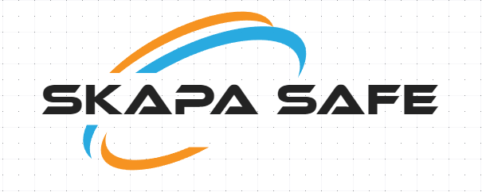

# SkapaSafe

<div id="top"></div>


<!-- PROJECT SHIELDS -->
<!--
*** I'm using markdown "reference style" links for readability.
*** Reference links are enclosed in brackets [ ] instead of parentheses ( ).
*** See the bottom of this document for the declaration of the reference variables
*** for contributors-url, forks-url, etc. This is an optional, concise syntax you may use.
*** https://www.markdownguide.org/basic-syntax/#reference-style-links
-->


<!-- PROJECT LOGO -->
<br />
<div align="center">
  <a href="https://github.com/othneildrew/Best-README-Template">
    
  </a>

  <h3 align="center">Skapa Safe</h3>

  <p align="center">
    Sistema de seguridad automatizado basado en sensores
    <br />
    <a href="https://github.com/othneildrew/Best-README-Template"><strong>Explore the docs »</strong></a>
    <br />
    <br />
    <a href="https://github.com/othneildrew/Best-README-Template">View Demo</a>
    ·
    <a href="https://github.com/othneildrew/Best-README-Template/issues">Report Bug</a>
    ·
    <a href="https://github.com/othneildrew/Best-README-Template/issues">Request Feature</a>
  </p>
</div>


<!-- TABLE OF CONTENTS -->
<details>
  <summary>Contenidos</summary>
  <ol>
    <li>
      <a href="#about-the-project">About The Project</a>
      <ul>
        <li><a href="#built-with">Built With</a></li>
      </ul>
    </li>
    <li>
      <a href="#getting-started">Getting Started</a>
      <ul>
        <li><a href="#prerequisites">Prerequisites</a></li>
        <li><a href="#installation">Installation</a></li>
      </ul>
    </li>
    <li><a href="#usage">Usage</a></li>
    <li><a href="#roadmap">Roadmap</a></li>
    <li><a href="#contributing">Contributing</a></li>
    <li><a href="#license">License</a></li>
    <li><a href="#contact">Contact</a></li>
    <li><a href="#acknowledgments">Acknowledgments</a></li>
  </ol>
</details>


<!-- ABOUT THE PROJECT -->
## Sobre el proyecto

El sistema IoT propuesto es una solución que garantice que todas las ventas de alcohol a menores de edad no se permitan dejando inaccesible la zona donde se encuentran las botellas de alcohol y solamente pudiendo acceder mediante el sistema IoT que nosotros proponemos que estará solamente al alcance de los trabajadores. 

El sistema incorpora las siguientes tecnologias
* Apertura y desbloqueo de puerta mediante un sensor de gestos
* Indicadores led y sonoros sel estado del bloqueo de la puerta
* Sistema de aviso sonoro para casos de robo


<p align="right">(<a href="#top">back to top</a>)</p>


<!-- GETTING STARTED -->
## Empezando

A continuacion se explican los requisitos y procedieminto a seguir para la instalacion y inicio del sistema Skapa Safe

### Prerequisitos

Para el correcto funcionamiento del sistema, en necesario tener instalado Python 3.1
* python
  ```sh
  apt get install python
  ```
  
 Ademas, sera necesario que todos los elementos iot que vamos a utilizar para la practica esten conectados al puerto correspondiente de su computadora, atendiendo a la siguiente manera:
 - Port 24: BUZZER
 - Port 26: LED Rojo
 - Port I2C: Pantalla LCD
 - Port I2C: Sensor de GESTOS
  
  
### Instalacion

Para el incio del sistema, sera necesario seguir los siguientes pasos

1. Clonar este repositorio
   ```
   git clone https://github.com/your_username_/Project-Name.git
   ```
2. Cambiar directorio a SkapaSafe
   ```
   cd SkapaSafe
   ```
4. Cambiar dentro de grove.py
   ```
   cd grove.py
   ```
5. Ejecutar el programa
   ```
   python main.py
   ```
<p align="right">(<a href="#top">back to top</a>)</p>


<!-- USAGE EXAMPLES -->
## Usabilidad

El sistema desarrollado, ante los estimulos que el usuario ejecute frente a el sensor de gestos, se comportara de la siguiente manera:

_Mediante un giro de muñeca hacia las agujas del reloj, se encienden los dispositivos LED y buzzer (durante 6 segundos) avisando que la puerta esta abierta_<br><br>
_Mediante un giro de muñeca hacia abajo, se activara el buzzer alertando de un supuesto robo_<br><br>
_Mediante un giro de muñeca en contra de las agujas del reloj, se desactivara la alerta por robo, apagando el sonido del buzzer._<br><br>
_Mediante un giro de muñeca hacia la derecha, se almacenan estadísticas de cada uno de los movimientos._<br><br>


<!-- LICENSE -->
## License

Distributed under the MIT License. See `LICENSE.txt` for more information.

<p align="right">(<a href="#top">back to top</a>)</p>


<!-- CONTACT -->
## Contact

Skapa Safe - [@skapaSafe](https://twitter.com/skapaSafe) - skapaSafel@gmail.com

Project Link: [https://github.com/AntonChavarria/skapa-safe](https://github.com/AntonChavarria/skapa-safe)

<p align="right">(<a href="#top">back to top</a>)</p>


<!-- ACKNOWLEDGMENTS -->
## Acknowledgments

Use this space to list resources you find helpful and would like to give credit to. I've included a few of my favorites to kick things off!

* [Choose an Open Source License](https://choosealicense.com)
* [GitHub Emoji Cheat Sheet](https://www.webpagefx.com/tools/emoji-cheat-sheet)
* [Malven's Flexbox Cheatsheet](https://flexbox.malven.co/)
* [Malven's Grid Cheatsheet](https://grid.malven.co/)
* [Img Shields](https://shields.io)
* [GitHub Pages](https://pages.github.com)
* [Font Awesome](https://fontawesome.com)
* [React Icons](https://react-icons.github.io/react-icons/search)

<p align="right">(<a href="#top">back to top</a>)</p>

